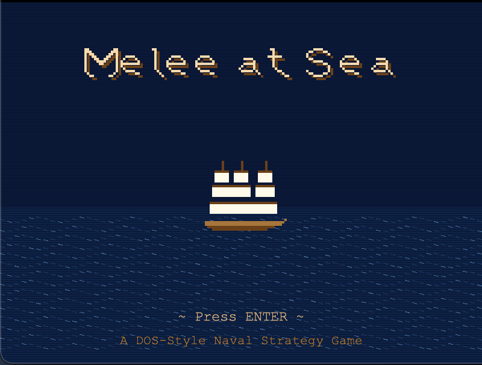
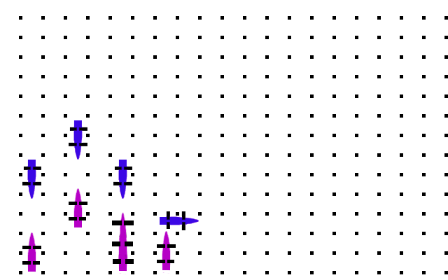

# Melee at Sea

A DOS-style turn-based naval strategy game built with Python and Pyglet.





## Features

- **Single Player** - Battle against AI opponents
- **Two Player** - Local multiplayer on the same machine
- Turn-based tactical combat with ship movement and broadside fire
- Retro DOS-inspired visual style

## Requirements

- Python 3.7+
- Pyglet

## Installation

```bash
pip install pyglet
```

## Running the Game

```bash
python main.py
```

## Controls

| Action                | Key               |
| --------------------- | ----------------- |
| Select ship           | Click on ship     |
| Move forward/backward | W/S or ↑/↓        |
| Rotate                | Q/E or A/D or ←/→ |
| Fire broadside        | SPACE or F        |
| Confirm move          | ENTER             |
| End turn              | ENTER             |
| Deselect              | TAB               |
| Restart (game over)   | R                 |
| Quit                  | ESC               |

## Gameplay

1. **Select** a ship by clicking on it
2. **Move** using WASD/arrow keys, **rotate** with Q/E
3. Press **ENTER** to confirm movement
4. Press **SPACE** to fire a broadside attack
5. Destroy all enemy ships to win!

## License

MIT
